<!--
THESIS: A build signal connects learning, products, and upstream work.
OWN-WORLD: Ink navy panels, pale typography, cyan signals, blue geometry, restrained violet.
STORY: Meet Ishu; explore concrete projects; inspect public contributions; connect.
FIRST VIEWPORT: Centered animated name banner, short student identity, and two clear links.
FORM: User-pinned premium technical portfolio; seed 2000cf0b is overridden by the explicit brief.
FINISH: unreviewed and undocumented is unfinished; this build ends with the finish review, the verdict, and DESIGN.md
Generated by scripts/generate-assets.py. Edit data/profile.json, then regenerate.
-->

  <picture>
    <source media="(prefers-reduced-motion: reduce) and (max-width: 600px)" srcset="assets/hero-mobile-static.svg" />
    <source media="(prefers-reduced-motion: reduce)" srcset="assets/hero-static.svg" />
    <source media="(max-width: 600px)" srcset="assets/hero-mobile.svg" />
    
  </picture>

  
  

I'm **Ishu Patel**, a Computer Science & Engineering student working on Java, data structures, and software that solves practical problems. I build full-stack projects, explore AI agents, and contribute fixes to open-source Java tools. Hackathons give me a reason to turn an idea into something people can try.

### On my workbench

<picture><source media="(prefers-reduced-motion: reduce) and (max-width: 600px)" srcset="assets/terminal-mobile-static.svg" /><source media="(prefers-reduced-motion: reduce)" srcset="assets/terminal-static.svg" /><source media="(max-width: 600px)" srcset="assets/terminal-mobile.svg" /></picture>

Current focus, in plain text

- **Learning:** Java & data structures
- **Building:** Practical software projects
- **Exploring:** AI agents & applied AI
- **Contributing:** Java open-source projects

### Tools I build with

**Languages** — Java · TypeScript · JavaScript

  
  
  

**Interface** — React · Next.js · Vite · HTML · CSS

  
  
  
  
  

**Server & data** — Node.js · Supabase · PostgreSQL

  
  
  

**Version control** — Git · GitHub

  
  

**Exploring:** AI agents, LLM-assisted applications, and explainable decision systems.

<picture><source media="(prefers-reduced-motion: reduce)" srcset="assets/divider-static.svg" /></picture>

## Selected projects

Small products, practical systems, and the ideas behind them. Cards open the source.

<a href="https://github.com/ishu7w/ScholarAI"><picture><source media="(max-width: 600px)" srcset="assets/project-cards/ScholarAI-mobile.svg" /></picture></a>
<a href="https://github.com/ishu7w/focusx"><picture><source media="(max-width: 600px)" srcset="assets/project-cards/focusx-mobile.svg" /></picture></a>
<a href="https://github.com/ishu7w/logistics-delivery-system"><picture><source media="(max-width: 600px)" srcset="assets/project-cards/logistics-delivery-system-mobile.svg" /></picture></a>
<a href="https://github.com/ishu7w/welltrack-ai"><picture><source media="(max-width: 600px)" srcset="assets/project-cards/welltrack-ai-mobile.svg" /></picture></a>

**Try the demos:** [ScholarAI](https://scholar-ai-rose.vercel.app/) · [FocusX](https://focusx-beta.vercel.app/) · [LogiPriority](https://logistics-delivery-system.onrender.com/) · [WellTrack AI](https://welltrack-ai.vercel.app/)

Project details, in plain text

**[ScholarAI](https://github.com/ishu7w/ScholarAI)** — Scholarship matching with transparent scoring and eligibility explanations. Built with Next.js · TypeScript · Supabase.

**[FocusX](https://github.com/ishu7w/focusx)** — A working focus timer with study-room and gamification UI using demo data. Built with React · JavaScript · Vite.

**[LogiPriority](https://github.com/ishu7w/logistics-delivery-system)** — Delivery scheduling powered by a custom max-heap priority queue. Built with React · Node.js · Express.

**[WellTrack AI](https://github.com/ishu7w/welltrack-ai)** — Habit tracking and rule-based insights in a dashboard with sample data. Built with React · JavaScript · Recharts.

<picture><source media="(prefers-reduced-motion: reduce)" srcset="assets/divider-static.svg" /></picture>

## In the open

<picture><source media="(max-width: 600px)" srcset="assets/analytics-mobile.svg" /></picture>

Numbers, sources & scope · updated 2026-09-13

- **14** public repositories, including forks.
- **0** stars across public, non-fork repositories (¹).
- **2** followers.
- **5** merged public pull requests outside my own repositories (²).
- Language proportions measure code bytes across public non-fork repositories; they are not proficiency ratings.
- [Snapshot and language totals](data/stats.json) · [GitHub profile](https://github.com/ishu7w)

### A year of contributions

<picture>
  <source media="(prefers-reduced-motion: reduce)" srcset="assets/contributions-static.svg" />
  <source media="(prefers-color-scheme: dark)" srcset="dist/github-contribution-grid-snake-dark.svg" />
  
</picture>

[Explore my contribution history](https://github.com/ishu7w?tab=overview) · Refreshed daily from GitHub.

### Java, DSA & real code

I'm learning data structures through Java and applying the same ideas in projects: a [max-heap delivery queue](https://github.com/ishu7w/logistics-delivery-system) and work on a [Java metro route planner](https://github.com/ishu7w/Delhi-Metro-Navigator). My focus is understanding the algorithm, the edge cases, and the tradeoffs.

### Beyond my own repositories

- **[Checkstyle](https://github.com/checkstyle/checkstyle/pull/21518)** — Correct file-extension parsing for dotted directories. *Merged.*
- **[Gson](https://github.com/google/gson/pull/3115)** — Avoid quadratic removeIf behavior in JsonArray list views. *Open.*
- **[Java Pathfinder](https://github.com/javapathfinder/jpf-core/pull/641)** — Fix position clamping when a buffer limit changes. *Open.*

<picture><source media="(prefers-reduced-motion: reduce)" srcset="assets/divider-static.svg" /></picture>

## Have a useful problem in mind?

I’m interested in practical AI products, open-source Java work, and hackathon collaborations. Let’s build something people can try.

<picture><source media="(prefers-reduced-motion: reduce)" srcset="assets/footer-static.svg" /></picture>

