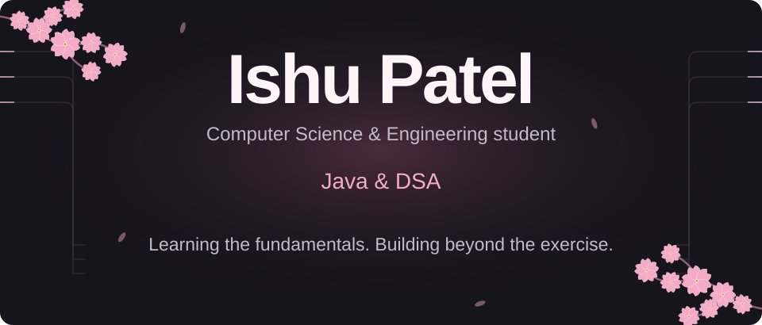
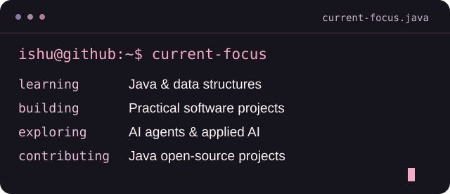
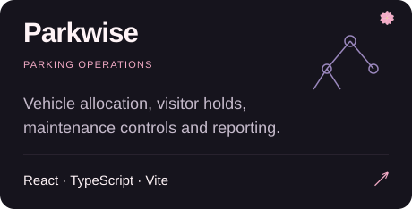
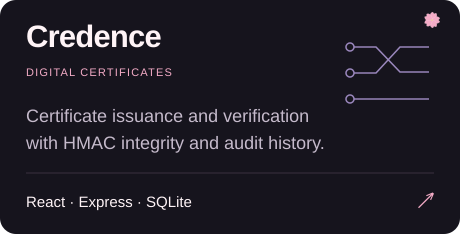
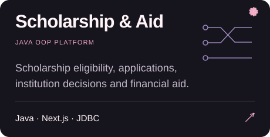
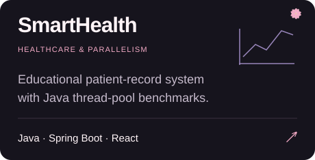
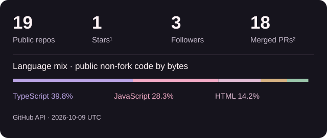

<!--
Sakura × circuitry. Original botanical SVG artwork; local, accessible assets.
Generated by scripts/generate-assets.py. Edit data/profile.json, then regenerate.
-->

  <picture>
    <source media="(prefers-reduced-motion: reduce) and (max-width: 600px)" srcset="assets/sakura/hero-mobile-static.svg" />
    <source media="(prefers-reduced-motion: reduce)" srcset="assets/sakura/hero-static.svg" />
    <source media="(max-width: 600px)" srcset="assets/sakura/hero-mobile.svg" />
    
  </picture>

  
  

I'm **Ishu Patel**, a Computer Science & Engineering student working on Java, data structures, and software that solves practical problems. I build full-stack projects, explore AI agents, and contribute fixes to open-source Java tools. Hackathons give me a reason to turn an idea into something people can try.

### On my workbench

<picture><source media="(prefers-reduced-motion: reduce) and (max-width: 600px)" srcset="assets/sakura/terminal-mobile-static.svg" /><source media="(prefers-reduced-motion: reduce)" srcset="assets/sakura/terminal-static.svg" /><source media="(max-width: 600px)" srcset="assets/sakura/terminal-mobile.svg" /></picture>

Current focus, in plain text

- **Learning:** Java & data structures
- **Building:** Practical software projects
- **Exploring:** AI agents & applied AI
- **Contributing:** Java open-source projects

### Tools I build with

**Languages** — Java · TypeScript · JavaScript

  
  
  

**Interface** — React · Next.js · Vite · HTML · CSS

  
  
  
  
  

**Server & data** — Node.js · Supabase · PostgreSQL

  
  
  

**Version control** — Git · GitHub

  
  

**Exploring:** AI agents, LLM-assisted applications, and explainable decision systems.

<picture><source media="(prefers-reduced-motion: reduce)" srcset="assets/sakura/divider-static.svg" /></picture>

## Latest projects

Recent builds in parking operations, digital credentials, financial aid, and parallel computing. Cards open the source.

<a href="https://github.com/ishu7w/parkwise"><picture><source media="(max-width: 600px)" srcset="assets/sakura/project-cards/parkwise-mobile.svg" /></picture></a>
<a href="https://github.com/ishu7w/digital-certification-system"><picture><source media="(max-width: 600px)" srcset="assets/sakura/project-cards/digital-certification-system-mobile.svg" /></picture></a>
<a href="https://github.com/ishu7w/scholarship-financial-aid-system"><picture><source media="(max-width: 600px)" srcset="assets/sakura/project-cards/scholarship-financial-aid-system-mobile.svg" /></picture></a>
<a href="https://github.com/ishu7w/SmartHealth"><picture><source media="(max-width: 600px)" srcset="assets/sakura/project-cards/SmartHealth-mobile.svg" /></picture></a>

**Hosted previews:** [Parkwise](https://parkwise-beta.vercel.app/) · [Credence](https://digital-certification-system-mu.vercel.app) · [Scholarship & Aid](https://scholarship-financial-aid-system.vercel.app)

Parkwise is a single-device prototype. Credence’s hosted preview is read-only; its full local system supports issuance and revocation. SmartHealth is an educational prototype; run its Java backend locally for the complete experience.

Project details, in plain text

**[Parkwise](https://github.com/ishu7w/parkwise)** — Vehicle allocation, visitor holds, maintenance controls and reporting. Built with React · TypeScript · Vite.

**[Credence](https://github.com/ishu7w/digital-certification-system)** — Certificate issuance and verification with HMAC integrity and audit history. Built with React · Express · SQLite.

**[Scholarship & Aid](https://github.com/ishu7w/scholarship-financial-aid-system)** — Scholarship eligibility, applications, institution decisions and financial aid. Built with Java · Next.js · JDBC.

**[SmartHealth](https://github.com/ishu7w/SmartHealth)** — Educational patient-record system with Java thread-pool benchmarks. Built with Java · Spring Boot · React.

<picture><source media="(prefers-reduced-motion: reduce)" srcset="assets/sakura/divider-static.svg" /></picture>

## In the open

<picture><source media="(max-width: 600px)" srcset="assets/sakura/analytics-mobile.svg" /></picture>

Numbers, sources & scope · updated 2026-10-07

- **18** public repositories, including forks.
- **1** stars across public, non-fork repositories (¹).
- **3** followers.
- **16** merged public pull requests outside my own repositories (²).
- Language proportions measure code bytes across public non-fork repositories; they are not proficiency ratings.
- [Snapshot and language totals](data/stats.json) · [GitHub profile](https://github.com/ishu7w)

[Explore my contribution history](https://github.com/ishu7w?tab=overview)

### Java, DSA & real code

I apply Java beyond practice problems: scholarship rules and persistent workflows in [Scholarship & Aid](https://github.com/ishu7w/scholarship-financial-aid-system), and measured sequential versus thread-pool processing in [SmartHealth](https://github.com/ishu7w/SmartHealth). My focus is understanding the algorithm, the edge cases, and the tradeoffs.

### Beyond my own repositories

- **[Checkstyle](https://github.com/checkstyle/checkstyle/pull/21518)** — Correct file-extension parsing for dotted directories. *Merged.*
- **[Gson](https://github.com/google/gson/pull/3115)** — Avoid quadratic removeIf behavior in JsonArray list views. *Merged.*
- **[Java Pathfinder](https://github.com/javapathfinder/jpf-core/pull/641)** — Fix position clamping when a buffer limit changes. *Merged.*

<picture><source media="(prefers-reduced-motion: reduce)" srcset="assets/sakura/divider-static.svg" /></picture>

## Have a useful problem in mind?

I’m interested in practical AI products, open-source Java work, and hackathon collaborations. Let’s build something people can try.

<picture><source media="(prefers-reduced-motion: reduce)" srcset="assets/sakura/footer-static.svg" /></picture>

